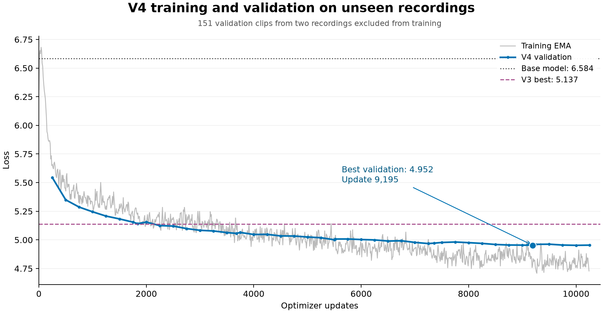

# Training quality update — 6 September 2026

The backend changes, expanded dataset, V4 training and generated-speech evaluation are complete. The recommended adapter is **V4 best, update 9,195**. It improves held-out predictive loss and measured transcription errors over V3; the detailed comparisons below also show metrics that remained similar or favored the base model. All audio measurements are automated proxies, not human listening ratings.

## App and training architecture

The Gradio app provides reference voice cloning, caption-driven and batch generation, dataset preparation, cached-feature LoRA/DoRA training, checkpoint evaluation and listening grids. Generation uses an autoregressive text-to-semantic GPT, semantic-to-mel synthesis, and a vocoder. Voice adaptation trains GPT attention/MLP adapters and, optionally, small speaker/emotion projections; the semantic encoder, codec, acoustic decoder and vocoder remain pretrained. This task focuses on the existing IndexTTS 2.5 model and its compatible adapter format.

## Findings and implemented changes

1. **Speech-token supervision precision.** Inference deliberately keeps Wav2Vec2-BERT in FP32, but the training cache used BF16. The encoder now runs in FP32 even inside an outer autocast context. Emotion projection retains its GPT-compatible precision. Cache format 2 binds each entry to the audio contents, transcript, language, speaker, model/config/tokenizer assets and extractor version. Old or stale caches are regenerated when feature caching is requested; old model files are preserved.
2. **Validation contamination.** Training reference selection previously drew from the entire dataset, including validation clips. References selected from other clips now come only from training clips. Validation rejects a held-out speaker with no training reference instead of silently conditioning on the target; explicitly selected self-reference validation remains available. Training propagates this error before loading the model, while a legitimately empty validation split still permits training. A new source split holds out complete recordings; explicit reviewed train/validation labels are also supported. Single-recording datasets fall back to a record split. Existing checkpoint evaluation defaults to its historical record split if the saved configuration has no split mode.
3. **Validation coverage and weighting.** The previous default used the first 20 validation batches in manifest order. The new default evaluates the whole holdout, every 250 updates and at epoch boundaries. A user-selected cap uses a reproducible shuffled order. Both trainer and checkpoint evaluator aggregate losses/accuracy by valid tokens, including the first stop token, so the score does not depend on evaluation batch grouping.
4. **Automatic stopping.** “Automatically stop when progress stalls” is a checkbox, enabled by default. Defaults: six validation checks without a loss improvement greater than 0.005, after at least 1,000 optimizer updates, completed warmup and two dataset passes. The absolute best checkpoint is preserved even when its tiny improvement does not reset patience. Patience, best step/loss and stopping reason survive continuation from saved optimizer state. Unchecking the control disables progress-based stopping. The live status shows best step and patience usage.
5. **Exact checkpoint selection.** The previous analysis retained only the last validation observation in each epoch. It now considers every observation, preserving a better mid-epoch checkpoint and reporting its exact step. `analysis/checkpoint_selection.json` records the protocol and live decision. Final checkpoint evaluation still compares saved candidates after training.
6. **Narration curation.** The collector accepts exactly one main MP4 with a matching SRT per topic and extracts mono 24 kHz, 24-bit FLAC without lossy recompression, denoising or gain changes. The optional curation tool checks subtitle/ASR agreement and CAMPPlus similarity for both whole clips and overlapping six-second windows. It writes every rejection and its reason, preserves the original prepared clips, and creates a separate final-test dataset.

## Source dataset and evaluation design

The source root is `F:\0_tutorial_videos_project\tutorial_videos`. The 17 selected main video/SRT pairs contain **11.0494 hours**. The extracted audio, byte-identical subtitles and provenance are in `G:\Index_TTS_v4\Lora_Training_Dataset_V2`; auxiliary recordings and duplicate MP3 exports are excluded.

Text overlap against the previous dataset confirmed that several tutorials were already used. Two previously unused recordings (`qwen_realism_and_inpainting`, `swramui_in_comfyi`) are reserved for development validation. `qwen_2511_tutorial` is reserved for final testing, outside the training dataset. Eight-word phrase overlap with the old training set is below 0.6% for these sources.

A calibration sample from the old dataset exposed a song-lyrics clip with speaker similarity 0.237 and a narration-to-song transition with a six-second-window minimum of 0.554 despite whole-clip similarity 0.904. This motivates checking windows instead of relying solely on an averaged embedding. Similarity is a screening signal, not an identity probability; borderline clean clips can be rejected in this quality-oriented run.

Preparation completed with 2,226 clips (570.34 minutes). The final audit retained audio from all 17 source recordings:

| Split | Clips | Speech minutes |
|---|---:|---:|
| Training | 1,839 | 471.08 |
| Validation: two complete recordings | 151 | 38.71 |
| Final test: separate recording | 89 | 23.00 |

The training portion is **7.8514 hours**, versus 4.4928 hours in V3: **74.75% more training audio**. The audit rejected 147 clips. Rejection reasons overlap: 53 failed whole-clip speaker similarity, 91 failed a speaker window, and 50 failed transcript agreement. Long-file ASR sometimes duplicated words while joining chunks; native transcription of 144 disputed extracted clips recovered 99 clean clips. The audit preserves both transcripts and both agreement scores.

The training/validation dataset is `datasets/furkan_v4_curated_20s`. Final-test targets live in `datasets/furkan_v4_curated_20s_test`, alongside 16 training-only reference clips required by the evaluator. No final-test target is present in the trainer's dataset. Raw prepared audio remains in `datasets/furkan_v4_raw_20s`; per-clip decisions are in `quality_audit.jsonl` and totals in `quality_summary.json`.

## V4 training and comparison settings

V4 starts from the pretrained base with DoRA rank 128, alpha 129, attention/MLP adapters and speaker projection training. It uses BF16 model execution, AdamW at 4e-5, cosine decay, 200 warmup updates, dropout 0.05, weight decay 0.01, batch size 1 and gradient accumulation 1. Ten epochs (18,390 optimizer updates) are an upper limit; progress-based stopping is enabled. Every 250 updates and at epoch boundaries, all 151 validation targets are evaluated with training-only reference conditioning. Training runs on the RTX 5090.

The old V3 checkpoint and the unadapted base were freshly evaluated with the corrected code, FP32-derived caches, identical reference policy and the same full validation set. Their validation losses are 5.137201 and 6.584303 respectively. Historical losses from older runs use a different protocol and are not directly comparable with these numbers.

Generated comparisons use the same reference WAV bytes, seed 20260906, adapter strength 1.0, speaking rate 1.0, three beams, temperature/top-p 0.8, top-k 30, repetition penalty 10, 25 diffusion steps and CFG 0.7. Development comparisons contain eight matched sentences from the two validation recordings plus three generic prompts and one longer narration. The final test uses twelve preselected sentences from the separate test recording. Pace calibration uses the matched development sentences; its recommendation is checked with a fresh seed.

These comparisons assess the combined new data and pipeline. This run is not a controlled ablation separating the contribution of each code change, curation rule or additional recording.

## Completed training result

Training stopped automatically at **10,250 of 18,390 updates**, after 5.57 dataset passes, because six validation checks failed to improve loss by more than 0.005. The run, including its automatic saved-checkpoint evaluation, took **58 minutes 59 seconds**. The best in-run checkpoint was update **9,195**, at the end of epoch five. Its saved optimizer state contains that same validation step and can continue from the next epoch; the final state contains the stopping reason and the correct partial-epoch position.

Fresh evaluation of the saved files confirms the same winner:

| Checkpoint | Full validation loss ↓ | Next-token accuracy ↑ |
|---|---:|---:|
| Base model | 6.584303 | 4.34% |
| V3 best, epoch 9 | 5.137201 | 9.65% |
| V4 best, update 9,195 | **4.952738** | **10.76%** |
| V4 final, update 10,250 | 4.954141 | 10.76% |

V4's best saved checkpoint reduces loss by **3.59% relative to V3** on the same 151 validation clips. This is a predictive-loss result, not a claim that perceived voice quality improves by that percentage. The final checkpoint continued reducing training loss but did not improve validation loss enough to justify continuing.

The best adapter's SHA-256 is `ccf915480ae0c87e8e47da3003bc2b0bfccbf629374ae7223c3f63a254b6fa6b`. The packaged reference is byte-identical to the verified V3 reference, so reference changes cannot explain the generated-comparison differences. Completion checks and checkpoint metadata are saved in `G:\Index_TTS_v4\training_v4\training_completion.json`.

## Development speech comparison and selection

All 48 planned recordings completed. Each model generated the same twelve prompts with the same reference and seed. Word error and reference-speaker similarity use all twelve prompts; matched style uses the eight prompts with real recordings. Speaker similarity is CAMPPlus cosine similarity to the reference; style similarity is cosine similarity to the real matched recording in the model's style embedding. Higher similarity is better for these proxies, but neither is a listening score or an identity probability.

| Checkpoint | Corpus word error ↓ | Speaker similarity ↑ | Style similarity to matched real speech ↑ |
|---|---:|---:|---:|
| Base model | 2.21% | 0.9394 | 0.5469 |
| V3 best | 3.23% | 0.9168 | 0.6532 |
| V4 best, update 9,195 | **2.72%** | **0.9298** | 0.6552 |
| V4 final, update 10,250 | 2.72% | 0.9241 | 0.6605 |

**Update 9,195 is the selected V4 checkpoint.** It has the lowest full validation loss, ties the final checkpoint's corpus word error, and has higher speaker similarity. Both V4 candidates transcribed without errors on the 129-word development narration; V3 had four errors. On the eight real matched recordings, the same ASR model has 3.49% word error, illustrating its own transcription noise. Technical terms and word boundaries such as `SwarmUI` versus `Swarm UI` contribute to these scores.

V4 improves the main development measurements over V3, but the unadapted base retains the lowest word error and highest reference-speaker similarity in this small prompt set. Its style similarity to the real narration is lower. These results support the selected adaptation for this voice; they do not establish a universal winner on every aspect of speech quality.

Using the eight matched validation sentences, edge-trimmed real and generated speech average 2.8463 and 2.8539 words/s respectively. The saved speaking rate is **0.997**, effectively the normal 1.0 pace. This replaces the earlier 1.051 estimate derived from unmatched training samples; the original estimate is retained in the experiment files. The calibrated rate is verified with a second seed after the primary fixed-rate test comparisons.

Raw measurements and all audio are in `G:\Index_TTS_v4\training_v4\grids\validation_v4_rate1`. `selected_checkpoint.json` records the checkpoint, development scores and selection time before the final test ran.

## Independent final test

The selected checkpoint was fixed before testing. All **89 targets** from `qwen_2511_tutorial` were evaluated; none was used for training or development checkpoint selection. The sixteen training-only clips in the test manifest supply references and are not test targets.

| Checkpoint | Full test loss ↓ | Next-token accuracy ↑ |
|---|---:|---:|
| Base model | 6.560383 | 4.45% |
| V3 best | 4.992473 | 10.65% |
| Selected V4 | **4.828838** | **11.55%** |

The **3.28% loss reduction versus V3** holds on this separate recording. Full raw results are stored outside the adapter's development-selection reports, in `G:\Index_TTS_v4\training_v4\final_test_eval\analysis\checkpoint_eval.json`.

The twelve fixed-rate test sentences produced 36 successful recordings:

| Checkpoint | Corpus word error ↓ | Speaker similarity ↑ | Style similarity to matched real speech ↑ | Median generated/real duration |
|---|---:|---:|---:|---:|
| Base model | 5.31% | 0.9358 | 0.5146 | 1.073 |
| V3 best | 6.83% | 0.9188 | 0.6093 | 1.041 |
| Selected V4 | **5.69%** | 0.9198 | 0.6066 | 1.052 |

V4 makes 30 ASR-scored word errors out of 527 words, versus V3's 36. The same recognizer makes 28 errors on the original recordings. The small speaker/style differences between V3 and V4 should not be treated as perceptual wins; the clearer result is lower predictive loss and fewer measured transcription errors. V4's mean matched speaking-rate ratio is 0.939, versus V3's 0.979, so it runs somewhat slower on this recording. No pace adjustment or checkpoint retuning was made using these test outcomes.

Test audio and measurements are in `G:\Index_TTS_v4\training_v4\grids\final_test_v4_rate1`. The ASR scores still include transcription ambiguity around technical names, numbers and compound words. The test covers one additional tutorial, not all speaking styles or languages.

## Fresh-seed verification

The saved 0.997 speaking rate was checked with seed 20260907 on the eight development sentences plus the long narration. All nine recordings completed. Corpus word error is **3.19%** (16/501 words); the 47.62-second narration has one ASR-scored error in 129 words. Mean matched speaking-rate ratio is **0.985**, and median generated/real duration is **1.025**, consistent with a normal speaking rate while allowing sentence-to-sentence variation. These nine prompts differ from the twelve-prompt comparison, so their aggregate WER is not directly compared with that table.

The verification grid is `G:\Index_TTS_v4\training_v4\grids\v4_calibrated_seed2`. Across all three grids, **93 generated WAV files** contain 26.34 minutes of audio. Every file is finite, non-silent, mono 22.05 kHz, and matches its recorded generation duration. Detailed amplitude and duration checks are in `G:\Index_TTS_v4\training_v4\audio_integrity.json`.

## Research used

- [IndexTTS 2.5 technical report](https://arxiv.org/html/2601.03888v1): 25 Hz semantic codes, conditioning architecture, and evaluating intelligibility, speaker similarity, emotion and listening quality. Its large-scale GRPO stage is not automatically transplanted into this small single-speaker adaptation task.
- [IndexTTS2 paper](https://arxiv.org/html/2506.21619v2): separate utterances from the same speaker for prompt and target conditioning.
- [Official IndexTTS repository](https://github.com/index-tts/index-tts): model architecture and inference behavior; local 2.5 code and model configuration determine compatibility.
- [Official DoRA implementation](https://github.com/NVlabs/DoRA): magnitude/direction adaptation. The existing implementation already detaches the weight norm and preserves FP32 adapter parameters, so no speculative replacement was made.
- [WhisperX](https://github.com/m-bain/whisperX): word alignment and speaker diarization as data-preparation concerns. The existing Whisper timing pipeline is retained, with additional transcript agreement and speaker-window checks.
- [scikit-learn GroupShuffleSplit](https://scikit-learn.org/stable/modules/generated/sklearn.model_selection.GroupShuffleSplit.html): separate related observations by group for meaningful generalization evaluation; implemented without adding a dependency.
- [Lightning early stopping source](https://raw.githubusercontent.com/Lightning-AI/pytorch-lightning/master/src/lightning/pytorch/callbacks/early_stopping.py): validation-check patience, minimum improvement, finite metrics and saved callback state. The app uses its own small tracker, without requiring Lightning.
- [PyTorch AMP documentation](https://docs.pytorch.org/docs/2.14/amp.html): disabling autocast around precision-sensitive subregions. The installed app environment is retained.
- [WeSpeaker](https://github.com/wenet-e2e/wespeaker): speaker embedding, similarity and diarization approaches, including CAMPPlus support.
- [IndexTTS2 fine-tuning implementation](https://github.com/instavar/indextts2-finetuning): separate prompt/target preprocessing and comparing neighboring checkpoints with generated samples. Its IndexTTS2 full-SFT defaults are not assumed valid for this app's 2.5 DoRA training.

## Code and pipeline verification

- Final full regression suite: **307 passed, 37 optional GPU tests skipped**, in 36.54 seconds. This includes the release-review regression confirming that invalid validation references stop training before model loading, while an empty validation split remains supported. The actual CUDA precision checks, training, checkpoint evaluation and 93 generated comparisons also completed successfully.
- Focused tests cover grouped/explicit splits, training-only references, missing reference speakers, token-weighted metrics, stale caches, FP32 encoder execution, early-stop grace/noise/resume/disable behavior, and exact mid-epoch checkpoint selection. The final reference-pool audit confirmed valid training references for all 151 development targets and all 89 test targets.
- Browser verification on an isolated local app instance confirmed the checkbox starts checked and can be unchecked/rechecked, with source holdout and full validation defaults exposed.
- GPU precision comparison on 12 clips (4,633 codes): the former BF16 encoder changed 418 labels (9.02%) relative to FP32 with identical batch grouping. FP32 batches versus individual FP32 extraction differed in 2 labels (0.043%). Raw measurements are in `G:\Index_TTS_v4\training_v4\semantic_precision.json`.
- Recovery checks cover FP16 overflow skipping without advancing the update schedule, same-step validation state in periodic checkpoints, and resetting comparisons when validation contents or cached audio change.
- The reusable grid-measurement CLI passed a real GPU smoke test on two saved generated recordings and a matched real recording. It reports corpus/macro WER, CAMPPlus similarity, GPT style similarity, voiced pitch and paired speech rate. These are automated proxies, not human listening ratings.

## Using the result

The paths below describe the completed local experiment. The Git release includes the code, report, and training curve; model weights, reference recordings, datasets, and raw generated audio remain local experiment artifacts.

- **Recommended adapter:** `loras/SECourses_Furkan_EN_DoRA_r128_v4/best/SECourses_Furkan_EN_DoRA_r128_v4.safetensors`.
- **Reference:** `loras/SECourses_Furkan_EN_DoRA_r128_v4/SECourses_Furkan_EN_DoRA_r128_v4_reference.wav`. Keep it with the adapter folder so the app can load it automatically.
- **Settings:** strength **1.0**, automatic reference and speaking-rate loading enabled, saved speaking rate **0.997**. The comparison sampling recipe and runtime are archived in `G:\Index_TTS_v4\training_v4\validation_grid_config.json`.
- **Model guide:** `loras/SECourses_Furkan_EN_DoRA_r128_v4/README.md`.
- **Prepared source collection:** `G:\Index_TTS_v4\Lora_Training_Dataset_V2`; curated training data: `datasets/furkan_v4_curated_20s`.
- **Reproducibility files:** `G:\Index_TTS_v4\training_v4` contains configurations, provenance checks, selection evidence, comparison audio, raw measurements and completed stage logs. The original model folders are preserved.

At completion, the local app at `http://127.0.0.1:7863` was verified with the V4 best checkpoint, its reference, and its calibrated pace selected. The default early-stop checkbox was enabled and verified in the restarted app. The experiment finished with no training or comparison jobs left running.
