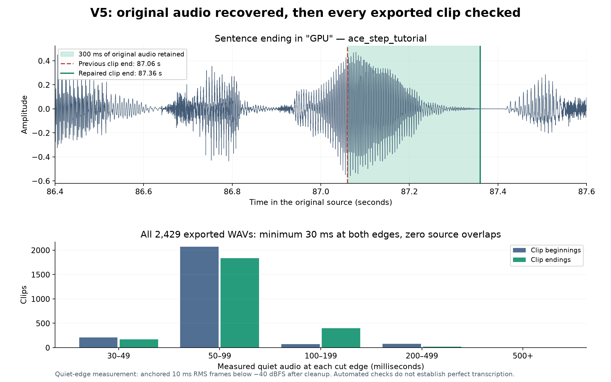
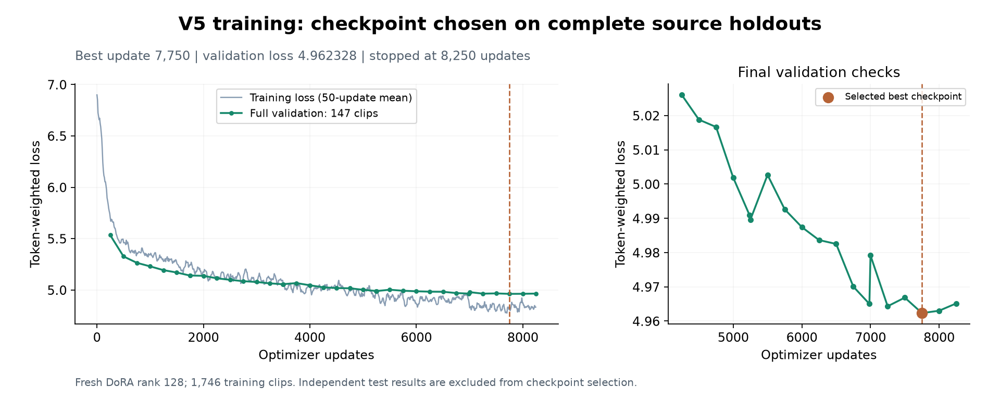

# V5 dataset repair and training verification

This run rebuilds the English narration dataset after finding cuts through word endings, then trains a fresh V5 DoRA adapter. Preparation, voice/transcript auditing, feature caching, training, and generated comparison grids are operated through the app in Google Chrome. Additional read-only analysis checks the actual files independently.

## Changes available in the distributed app

Sentence-aligned preparation now searches the original recording for sustained pauses and repacks whole sentences around them. It prioritizes retaining caption words, then proximity to the requested clip duration. When a proposed sentence boundary is unsafe, adjacent sentences can be grouped or moved between clips. A shared boundary uses one pause decision even when neighboring clips receive different loudness gains.

The default quiet-edge requirement is 30 ms, measured on the actual exported waveform after trimming and loudness normalization. The default search window is 400 ms. Sentences that cannot fit a safe group and exported clips that fail their edge check are recorded in `sentence_rejections.jsonl` and `boundary_rejections.jsonl`. Existing pre-segmented imports retain their established behavior.

The dataset tab also exposes **Voice and transcript audit**. Users supply a clean speaker reference and source recordings to hold out for validation, with an optional separate test recording. The app checks whole-clip and overlapping-window speaker similarity, freshly transcribes accepted-voice clips, and checks the first and last two normalized words separately from overall word error. It writes a separate dataset and a per-clip audit ledger, then selects the result for feature caching and training. Original prepared recordings are preserved.

Browser testing also identified and fixed misleading feature-cache progress and checkpoint selection replacing custom comparison texts or references. Cache cards now show worker counts, percentage, speed, and ETA. Dataset preparation no longer reports complete progress merely because one source's transcription has finished.

A separate regression exposed accumulated silence-analysis drift at the supported 22.05 kHz output setting: 100 seconds produced 10,023 analysis frames instead of 10,000. Frames now use their absolute timestamps. V5 uses 24 kHz, whose integral sample counts already align with the frame times.

## Rebuilt dataset checks

The input contains the same 17 narration recordings and subtitle sidecars used for V4, totaling approximately 11.05 hours. The final export, `datasets/furkan_v5_verified_20s`, contains **2,429 clips / 575.17 minutes**. Every output is finite, mono, and 24 kHz. Independent inspection of all saved WAVs found:

- At least **30 ms of quiet audio at both edges** of every clip, using the configured -40 dBFS threshold.
- **Zero overlapping source intervals** among neighboring clips from the same recording.
- The expected shared-pause repacking algorithm on every clip.
- Consistent IDs, waveform lengths, manifest durations, and completed dataset metadata.

These checks establish the measured boundary conditions. Quiet intervals and ASR are screening signals, so they do not establish that every pronunciation or transcript is perfect.

Four previously investigated cut passages were recovered from their original recordings and passed the final voice/transcript audit:

| Passage | Previous cut | Repacked clip | Source interval | Quiet beginning / ending |
|---|---:|---|---|---:|
| Tutorial sentence ending in GPU | 87.06 s | `ace_step_tutorial_0005` | 75.876667-87.36 s | 80 / 60 ms |
| CUDA tutorial | 2243.30 s | `cuda13_tutorial_0139` | 2232.76-2248.35 s | 60 / 70 ms |
| Qwen training tutorial | 3265.38 s | `qwen_fine_tuning_0211` | 3261.05-3275.11 s | 70 / 60 ms |
| Z-Image training tutorial | 2837.40 s | `z_image_training_0187` | 2825.70-2840.08 s | 40 / 60 ms |

The GPU example retains another 300 ms of original recording. The other examples are now inside larger complete sentence groups, so they no longer require a cut at the problematic location.

## Voice and transcript audit

The final audit uses maximum word error 0.15, whole-clip speaker similarity at least 0.70, window similarity at least 0.60, fresh clip ASR, matching transcript boundary words, and a 30 ms quiet-edge minimum. It retains:

| Split | Clips | Minutes | Source recordings |
|---|---:|---:|---|
| Training | 1,746 | 415.35 | 14 recordings |
| Validation | 147 | 34.48 | `qwen_realism_and_inpainting`, `swramui_in_comfyi` |
| Independent test | 79 | 18.44 | `qwen_2511_tutorial` |

The training/validation dataset is `datasets/furkan_v5_curated_20s`; test targets are in `datasets/furkan_v5_curated_20s_test`. Sixteen training-only clips accompany the test targets as evaluator references and are excluded from the test score. Source recordings are disjoint across the three target splits. Every retained WAV is byte-identical to its verified prepared counterpart.

The audit rejects 457 candidates. Overlapping reason counts are 327 transcript-boundary mismatches, 134 overall transcript disagreements, 71 voice-window failures, and 39 whole-clip voice failures. Technical names and ASR mistakes can reject otherwise clean speech; the full decisions and both source/clip transcripts remain in `quality_audit.jsonl`. This stricter run contains less training audio than V4 despite retaining slightly more audio at the preparation stage.

All 1,893 training/validation clips and 95 test/reference clips were cached successfully with FP32 semantic features. There are no entries over the training token limits. The cache progress fix was verified in Chrome during the 95-clip run, including its final 95/95 count.

Independent inspection of all 1,988 cached tensors confirms their audio/transcript fingerprints, semantic precision, tensor shapes, finite embeddings, and valid token ranges. The greatest difference between waveform duration and semantic-code duration is 34.69 ms, within the 40 ms code interval.

## Training and comparison protocol

V5 starts from the pretrained base, using V4's training settings: DoRA rank 128, alpha 129, attention and MLP adapters plus speaker projection, BF16 execution, AdamW at 4e-5, cosine decay, 200 warmup updates, dropout 0.05, batch size 1, and accumulation 1. Ten epochs / 17,460 updates is the upper limit. Full validation runs every 250 updates and at epoch boundaries. Automatic stopping allows six checks without a meaningful improvement greater than 0.005 after at least 1,000 updates and two dataset passes.

Generated comparisons use the same verified reference WAV, seed 20260906, strength 1.0, speaking rate 1.0, three beams, temperature/top-p 0.8, top-k 30, repetition penalty 10, 25 diffusion steps, and CFG 0.7. Thirteen fixed prompts include the original sentence ending in "uses" and the twelve V4 test prompts. Base and V4 comparisons are freshly generated with the corrected inference code. Training references never use validation or test targets.

The changed segmentation and stricter curation alter the evaluation clips. Comparisons therefore re-evaluate all models on the same V5 test set; historical V4 loss values use different clips and cannot directly establish an improvement.

The final full regression suite passes **396 tests**, with 39 optional cases skipped, in 45.25 seconds. Coverage includes recovered endings, sentence retention, shared pauses under different loudness gains, all supported output sample rates, waveform checks, audit rejection behavior, source holdouts, preserved comparison inputs, and UI construction. Chrome also verified live progress, completed dataset handoff to training, preset restoration, and reattaching an active V5 training job with **Load last values**.

Post-training Chrome testing also exposed a stale checkpoint list after **Refresh** and a summary that called training "still improving" when the best and final files came from different updates in the same epoch. Refresh now reloads the selected run's complete analysis, and summaries compare exact update positions. The latest-sample label uses the sample's filename instead of incorrectly appending the current training epoch. The updated grid/UI checks pass 24 tests, and checkpoint/analysis checks pass 19 tests, including a regression that failed before the summary fix.

## Completed V5 training

Training stopped automatically at **8,250 of 17,460 updates**, after 4.73 dataset passes. Six validation checks did not improve loss by more than 0.005. The trainer, including automatic evaluation of all seven saved/base candidates, reported **50 minutes 4 seconds**. Four complete-epoch samples were saved; training stopped partway through epoch five.

The selected V5 checkpoint is **update 7,750**, with in-run validation loss 4.962328. Fresh evaluation of the serialized files confirms the same winner:

| Checkpoint | Full validation loss, lower is better | Next-token accuracy |
|---|---:|---:|
| Base | 6.576409 | 4.17% |
| V5 best, update 7,750 | **4.962597** | 10.62% |
| V5 final, update 8,250 | 4.965366 | 10.63% |

The small difference between the in-run and serialized-best scores is consistent with evaluating saved BF16 weights. Selection uses the measured saved checkpoint. All 290 tensors in that file are finite. Its SHA-256 is `67445d9dcb5c4cbebe787e12b636dd8d0c250b8d1ed35715c5db335365e73749`.

Selection was recorded at **2026-09-06 15:23:21 UTC**, before independent testing. The adapter's packaged reference and the comparison reference are byte-identical to the fixed reference used for V4. The reference SHA-256 is `5dbe4fcea9f707a4e78e8dfe250e8a189dcb149300da074aa491fb25a303d344`.

## Independent test result

All 79 test targets were evaluated with the same features, reference policy, and token weighting for all three models. The 16 accompanying training reference clips are excluded from scores. Results are stored separately from V5's development checkpoint-selection files.

| Checkpoint | Full independent test loss | Next-token accuracy |
|---|---:|---:|
| Base | 6.567567 | 4.25% |
| V4 best, update 9,195 | **4.823071** | **11.36%** |
| Selected V5, update 7,750 | 4.838412 | 11.30% |

V5 has **0.32% higher predictive loss than V4** on these same clips. That is a small regression, despite the independently verified dataset repairs. The stricter V5 curation also reduces the amount of training audio. This experiment does not isolate segmentation, curation, or training duration, and it does not establish that V5 is universally better. No checkpoint or speaking-rate adjustment was made using the test results.

## Generated speech comparison

Chrome generated all **39 planned recordings**: 13 each for base, V4 best, and V5 best. All WAVs are finite, non-silent, mono 22.05 kHz, and agree with their recorded generation durations. Together they contain **10.60 minutes** of audio. Saved configuration comparison confirms identical prompts, reference paths, seed, runtime, and inference settings; only the checkpoint and output identities differ.

The following table uses the **12 independent test prompts / 527 words**. Speaker similarity is CAMPPlus cosine similarity to the fixed reference; style similarity compares the first 20 seconds of each generated/matched real recording using the model's style embedding. Duration uses the full recording. These are automated proxies, not human listening ratings.

| Model | ASR word errors | Corpus word error | Speaker similarity | Style similarity to real speech | Median generated/real duration |
|---|---:|---:|---:|---:|---:|
| Base | **24 / 527** | **4.55%** | **0.9353** | 0.5047 | 1.074 |
| V4 best | 30 / 527 | 5.69% | 0.9193 | **0.6113** | 1.094 |
| V5 best | 28 / 527 | 5.31% | 0.9222 | 0.6067 | **1.065** |

V5 makes two fewer ASR-scored errors than V4, has slightly higher reference-speaker similarity, slightly lower matched-style similarity, and a median duration ratio closer to the real recordings. The same recognizer makes **28 errors on the original recordings**, illustrating transcription ambiguity around technical names. These small differences do not support a strong perceptual ranking.

Across all 13 prompts, including the original problem sentence, corpus word error is 4.33% for base, 5.60% for V4, and 5.42% for V5. Strict first/last-two-word matching passes 11/13, 12/13, and 11/13 respectively. V5's two mismatches involve `nvitop` at a beginning and `tutorial` versus `tutorials` at an ending; the per-clip transcripts remain available for review.

The original sentence ending in **"what generation uses"** retains those final words in all three freshly generated versions. V5's recognizer output contains two other errors across its 27 words: an added "the" and `FFmpeg` transcribed as `FFMP`. The actual generated V5 WAV has about 20 ms of trailing quiet audio at -40 dBFS, versus zero measured quiet tail for V4 and about 170 ms for base. Chrome playback reaches the end normally. These observations support the retained ending in this sample, not perfect pronunciation or a guarantee for every random seed.

The automatic training-sample pace estimate is **1.049**, based on four samples versus the training dataset's average words per second. It is preserved as an estimate; all reported model comparisons use **1.0**, and no matched-text pace calibration was performed for V5.

## Using and reproducing the result

- **Selected V5 adapter:** `loras/SECourses_Furkan_EN_DoRA_r128_v5/best/SECourses_Furkan_EN_DoRA_r128_v5.safetensors`.
- **Packaged reference:** `loras/SECourses_Furkan_EN_DoRA_r128_v5/SECourses_Furkan_EN_DoRA_r128_v5_reference.wav`.
- **Comparison recipe:** strength 1.0, speaking rate 1.0, seed 20260906, and the sampling settings above. The app can automatically load the packaged reference and its separate 1.049 pace estimate.
- **V5 comparison audio:** `outputs/grids/SECourses_Furkan_EN_DoRA_r128_v5_20260906_182441_442451`; the original problem sentence is `best_ep5__s1__ref1__t1.wav`.
- **Base/V4 comparison audio:** `outputs/grids/SECourses_Furkan_EN_DoRA_r128_v4_20260906_165259_500864`.
- **Local verification evidence:** `.ui_state/user_workflow_audit/v5_selected_checkpoint.json`, `v5_final_verification.json`, `v5_final_test_eval/analysis/checkpoint_eval.json`, and the per-grid ASR/quality reports in the same audit folder.

The distributed source includes the preparation/audit/progress/selection fixes, regression coverage, this report, and its figures. Datasets, model weights, speaker references, raw audio, and machine-specific verification files remain local. Other users can run the same preparation, voice/transcript audit, caching, training, automatic checkpoint evaluation, and listening-grid workflow from the app with their own recordings.
